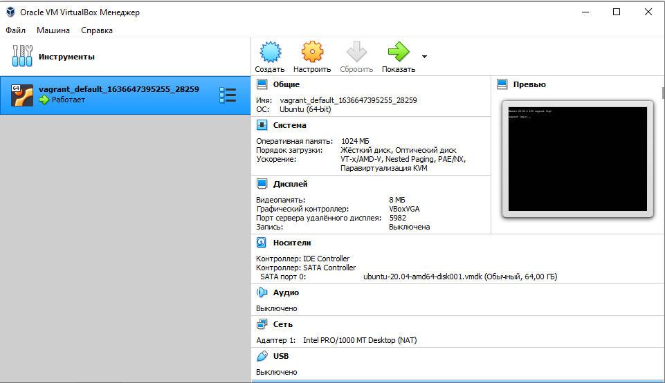
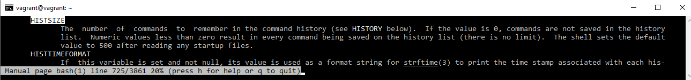
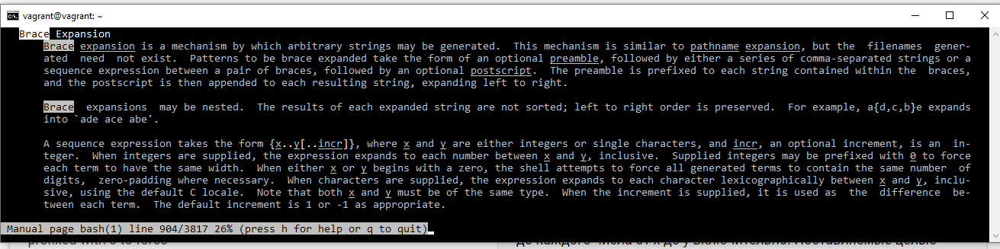

## Домашнее задание к занятию «3.1. Работа в терминале, лекция 1» - Денис Поляков
### Задание №1,2,3,4,5
```
C:\Users\nedago\Dropbox\vagrant>vagrant up  
Bringing machine 'default' up with 'virtualbox' provider...  
==> default: Checking if box 'bento/ubuntu-20.04' version '202012.23.0' is up to date...  
==> default: A newer version of the box 'bento/ubuntu-20.04' for provider 'virtualbox' is  
==> default: available! You currently have version '202012.23.0'. The latest is version  
==> default: '202107.28.0'. Run `vagrant box update` to update.  
==> default: Clearing any previously set forwarded ports...  
==> default: Clearing any previously set network interfaces...  
==> default: Preparing network interfaces based on configuration...  
    default: Adapter 1: nat  
==> default: Forwarding ports...  
    default: 22 (guest) => 2222 (host) (adapter 1)  
==> default: Booting VM...  
==> default: Waiting for machine to boot. This may take a few minutes...  
    default: SSH address: 127.0.0.1:2222  
    default: SSH username: vagrant  
    default: SSH auth method: private key  
    default: Warning: Connection reset. Retrying...  
    default: Warning: Connection aborted. Retrying...  
    default: Warning: Remote connection disconnect. Retrying...  
    default: Warning: Connection reset. Retrying...  
    default: Warning: Connection aborted. Retrying...  
    default:  
    default: Vagrant insecure key detected. Vagrant will automatically replace  
    default: this with a newly generated keypair for better security.  
    default:  
    default: Inserting generated public key within guest...  
    default: Removing insecure key from the guest if it's present...  
    default: Key inserted! Disconnecting and reconnecting using new SSH key...  
==> default: Machine booted and ready!  
==> default: Checking for guest additions in VM...  
==> default: Mounting shared folders...  
    default: /vagrant => C:/Users/nedago/Dropbox/vagrant  
```
### Задание №5
Ознакомьтесь с графическим интерфейсом VirtualBox, посмотрите как выглядит виртуальная машина, которую создал для вас Vagrant, какие аппаратные ресурсы ей выделены. Какие ресурсы выделены по-умолчанию?



-  выделенная машина с 1024Мб оперативной памяти и 64Гб диском по умолчанию 

### Задание №6
Создать машину с 1024М RAM и 2CPU
```
config.vm.provider "virtualbox" do |test|  
  test.memory = 1024  
  test.cpus = 2  
end  
```

### Задание №7
Команда `vagrant ssh` из директории, в которой содержится Vagrantfile, позволит вам оказаться внутри виртуальной машины без каких-либо дополнительных настроек. Попрактикуйтесь в выполнении обсуждаемых команд в терминале Ubuntu.
``` 
C:\Users\nedago\Dropbox\vagrant>vagrant ssh  
Welcome to Ubuntu 20.04.1 LTS (GNU/Linux 5.4.0-58-generic x86_64)  
  
 * Documentation:  https://help.ubuntu.com  
 * Management:     https://landscape.canonical.com  
 * Support:        https://ubuntu.com/advantage  
  
  System information as of Thu 11 Nov 2021 05:42:09 PM UTC  
  
  System load:  0.08              Processes:             99  
  Usage of /:   2.2% of 61.31GB   Users logged in:       0  
  Memory usage: 13%               IPv4 address for eth0: 10.0.2.15  
  Swap usage:   0%  
  
  
This system is built by the Bento project by Chef Software  
More information can be found at https://github.com/chef/bento  
vagrant@vagrant:~$  
```  
Практикуюсь в выполнении команд:
```
vagrant@vagrant:~$ ls  
vagrant@vagrant:~$ pwd  
/home/vagrant  
vagrant@vagrant:~$ whoami  
vagrant  
vagrant@vagrant:~$ touch 1.txt  
vagrant@vagrant:~$ vi 1.txt  
vagrant@vagrant:~$ cat 1.txt  
test1  
vagrant@vagrant:~$ echo Hello world  
Hello world  
vagrant@vagrant:~$ echo $USER  
vagrant  
vagrant@vagrant:~$ $SHELL --version  
GNU bash, version 5.0.17(1)-release (x86_64-pc-linux-gnu)  
Copyright (C) 2019 Free Software Foundation, Inc.  
License GPLv3+: GNU GPL version 3 or later <http://gnu.org/licenses/gpl.html>  
  
This is free software; you are free to change and redistribute it.  
There is NO WARRANTY, to the extent permitted by law.  
vagrant@vagrant:~$ new_variable=new_text  
vagrant@vagrant:~$ echo $new_variable  
new_text  
vagrant@vagrant:~$ read new_variable  
new_text_read  
vagrant@vagrant:~$ echo $new_variable  
new_text_read  
vagrant@vagrant:~$ reset  
vagrant@vagrant:~$ ll  
total 44  
drwxr-xr-x 4 vagrant vagrant 4096 Nov 11 17:43 ./  
drwxr-xr-x 3 root    root    4096 Dec 23  2020 ../  
-rw-rw-r-- 1 vagrant vagrant    7 Nov 11 17:43 1.txt  
-rw-r--r-- 1 vagrant vagrant  220 Dec 23  2020 .bash_logout  
-rw-r--r-- 1 vagrant vagrant 3771 Dec 23  2020 .bashrc  
drwx------ 2 vagrant vagrant 4096 Dec 23  2020 .cache/  
-rw-r--r-- 1 vagrant vagrant  807 Dec 23  2020 .profile  
drwx------ 2 vagrant root    4096 Nov 11 17:20 .ssh/  
-rw-r--r-- 1 vagrant vagrant    0 Dec 23  2020 .sudo_as_admin_successful  
-rw-r--r-- 1 vagrant vagrant    6 Dec 23  2020 .vbox_version  
-rw------- 1 vagrant vagrant  760 Nov 11 17:43 .viminfo  
-rw-r--r-- 1 root    root     180 Dec 23  2020 .wget-hsts  
vagrant@vagrant:~$ cd ../  
vagrant@vagrant:/home$ ls  
vagrant  
vagrant@vagrant:/home$ cd vagrant/.s  
.ssh/                      .sudo_as_admin_successful  
vagrant@vagrant:/home$ cd vagrant/.ssh/  
vagrant@vagrant:~/.ssh$ ls  
authorized_keys  
vagrant@vagrant:~/.ssh$ cat authorized_keys  
ssh-rsa AAAAB3NzaC1yc2EAAAADAQABAAABAQCRunOpAwhtuJ22ogvBqWV8lNZQKsE/v7MopJca/n2Br9LxndWfiMKe+WfKGujnYq3pRgbK/zMFweJuu5N1gan2k1R7EbD9XAuRQw/zICphzMhtT28EDnPAZwmSaYzeBo/kkodqrgbF/0zyYmVG+PSBczMCEIVAiGjdieed+5XN0QeDkDYbgi+5Fs14DbMA2mrHT1yJvDMPZHTl6GlUAzDGJT7FWHTXWCk10GruUitRaYLplI323bMDVmNtv0Vd1F0lmiuVwmio/W/Et8QAV3cS/LHMaX5oHTOi0bPK5G682Vi5guFXp+yjiOyGfD/Qz9sVlK0ZWqyLNyaWzGIidhzZ vagrant  
vagrant@vagrant:~/.ssh$  
```

### Задание №8
- какой переменной можно задать длину журнала history, и на какой строчке manual это описывается?
переменной `HISTSIZE`
``` 
vagrant@vagrant:~$ HISTSIZE=10  
vagrant@vagrant:~$ history  
   11  ls -lha  
   12  which  
   13  echo env  
   14  env  
   15  uptime  
   16  man bash  
   17  history  
   18  HISTSIZE=20  
   19  HISTSIZE=10  
   20  history  
vagrant@vagrant:~$  
```
переменной `HISTSIZE`; 725 строка в `man` 

- что делает директива ignoreboth в bash?
```  
export HISTCONTROL=ignoreboth:erasedups  
Опция HISTCONTROL контролирует каким образом список команд сохраняется в истории.  
ignorespace — не сохранять строки начинающиеся с символа <пробел>  
ignoredups — не сохранять строки, совпадающие с последней выполненной командой  
ignoreboth — использовать обе опции ‘ignorespace’ и ‘ignoredups’  
erasedups — удалять ВСЕ дубликаты команд с истории  
``` 
директива `ignoreboth` использует обе опции `ignorespace` и `ignoredups` в команде `HISTCONTROL`  

### Задание №9
В каких сценариях использования применимы скобки `{}` и на какой строчке `man bash` это описано?

Brace Expansion, в `man` на 904 строке 

### Задание №10
Основываясь на предыдущем вопросе, как создать однократным вызовом `touch` 100000 файлов? А получилось ли создать 300000? Если нет, то почему?

```  
vagrant@vagrant:~$ touch {1..100000}.txt  
vagrant@vagrant:~$ touch {1..300000}.txt  
-bash: /usr/bin/touch: Argument list too long  
vagrant@vagrant:~$ getconf ARG_MAX  
2097152  
```
В этом ядре ограничение на длинну командной строки 2097152 символа. Диапазон имен от 1 до 300000 не помещяется в это ограничение.


### Задание №11
В man bash поищите по `/\[\[.` Что делает конструкция `[[ -d /tmp ]]`
```  
[[ выражение ]]  
Возвращает статус 0 или 1 в зависимости от значения указанного  
условного выражения  
-d файл  
Истинно, если файл существует и является каталогом.  
```
`[[-d /tmp]]` - возвращает True если каталог существует.

### Задание №12
Основываясь на знаниях о просмотре текущих (например, PATH) и установке новых переменных; командах, которые мы рассматривали, добейтесь в выводе type -a bash в виртуальной машине наличия первым пунктом в списке.
```  
vagrant@vagrant:~$ type -a bash  
bash is /usr/bin/bash  
bash is /bin/bash  
vagrant@vagrant:~$ mkdir /tmp/new_path_directory  
vagrant@vagrant:~$ cp  /bin/bash /tmp/new_path_directory/  
vagrant@vagrant:/usr/local$ sudo cp /bin/bash /usr/local/bin/  
vagrant@vagrant:/usr/local/bin$ echo $PATH  
/usr/local/sbin:/usr/local/bin:/usr/sbin:/usr/bin:/sbin:/bin:/usr/games:/usr/local/games:/snap/bin  
vagrant@vagrant:/usr/local/bin$ export PATH=/tmp/new_path_directory:/usr/local/bin:/bin:$PATH  
vagrant@vagrant:/usr/local/bin$ type -a bash  
bash is /tmp/new_path_directory/bash  
bash is /usr/local/bin/bash  
bash is /bin/bash  
bash is /usr/bin/bash  
bash is /bin/bash  
vagrant@vagrant:~$  
```

### Задание №13
Чем отличается планирование команд с помощью `batch` и `at`?  
Команда `at` - используется для назначения одноразового задания на заданное время   
Команда `batch` — для назначения одноразовых задач, которые должны выполняться, когда загрузка системы становится меньше 0,8.  

### Задание №14
Завершите работу виртуальной машины чтобы не расходовать ресурсы компьютера и/или батарею ноутбука.
```
vagrant halt
```
