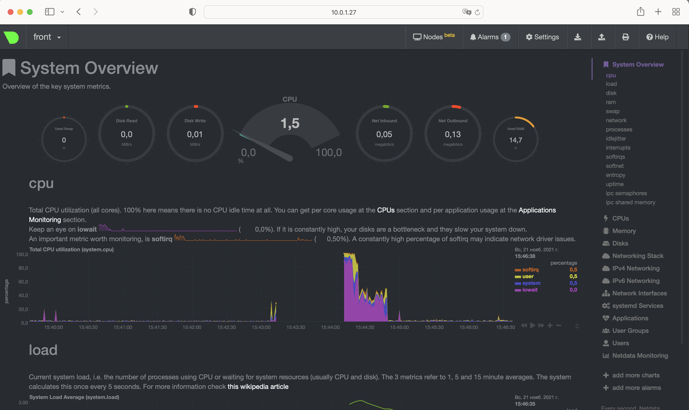

## Домашнее задание к занятию "3.4. Операционные системы, лекция 2" - Денис Поляков

### Задание №1
На лекции мы познакомились с [node_exporter](https://github.com/prometheus/node_exporter/releases). В демонстрации его исполняемый файл запускался в background. Этого достаточно для демо, но не для настоящей production-системы, где процессы должны находиться под внешним управлением. Используя знания из лекции по systemd, создайте самостоятельно простой [unit-файл](https://www.freedesktop.org/software/systemd/man/systemd.service.html) для node_exporter:

    * поместите его в автозагрузку,
    * предусмотрите возможность добавления опций к запускаемому процессу через внешний файл (посмотрите, например, на `systemctl cat cron`),
    * удостоверьтесь, что с помощью systemctl процесс корректно стартует, завершается, а после перезагрузки автоматически поднимается.

[Статья: "Systemd за пять минут"](https://habr.com/ru/company/southbridge/blog/255845/)   
[Руководство по настройке node_exporter](https://github.com/prometheus/node_exporter/tree/master/examples/systemd)  
Помещаю юнит в `/etc/systemd/system`
```
[Unit]
Description=Node Exporter

[Service]
User=node_exporter
ExecStart=/usr/sbin/node_exporter --collector.textfile.directory /var/lib/node_exporter/textfile_collector
#ExecStart=/usr/sbin/node_exporter $OPTIONS
#OPTIONS="--collector.textfile.directory /var/lib/node_exporter/textfile_collector"

[Install]
WantedBy=multi-user.target
```
Создаю путой файл для опций collector `/var/lib/node_exporter/textfile_collector` и назначаю ему права
```
root@front:/var/lib/node_exporter# useradd node_exporter
root@front:/var/lib/node_exporter# chown node_exporter:node_exporter textfile_collector
```
Перегружаю systemd:
```
vagrant@front:/usr/local/bin$ sudo systemctl daemon-reload
```
Помещаю юнит в автозагрузку:
```
vagrant@front:/etc/systemd/system$ sudo systemctl enable node_exporter
Created symlink /etc/systemd/system/multi-user.target.wants/node_exporter.service → /etc/systemd/system/node_exporter.service.
```
Смотрю корректность работы:
```
root@front:/var/lib/node_exporter# systemctl status node_exporter
● node_exporter.service - Node Exporter
     Loaded: loaded (/etc/systemd/system/node_exporter.service; enabled; vendor preset: enabled)
     Active: active (running) since Mon 2021-11-22 09:18:08 UTC; 2s ago
   Main PID: 1957 (node_exporter)
      Tasks: 4 (limit: 1073)
     Memory: 2.5M
     CGroup: /system.slice/node_exporter.service
             └─1957 /usr/sbin/node_exporter --collector.textfile.directory /var/lib/node_exporter/textfile_collector

Nov 22 09:18:08 front node_exporter[1957]: ts=2021-11-22T09:18:08.352Z caller=node_exporter.go:115 level=info collector=thermal_zone
Nov 22 09:18:08 front node_exporter[1957]: ts=2021-11-22T09:18:08.352Z caller=node_exporter.go:115 level=info collector=time
Nov 22 09:18:08 front node_exporter[1957]: ts=2021-11-22T09:18:08.352Z caller=node_exporter.go:115 level=info collector=timex
Nov 22 09:18:08 front node_exporter[1957]: ts=2021-11-22T09:18:08.352Z caller=node_exporter.go:115 level=info collector=udp_queues
Nov 22 09:18:08 front node_exporter[1957]: ts=2021-11-22T09:18:08.352Z caller=node_exporter.go:115 level=info collector=uname
Nov 22 09:18:08 front node_exporter[1957]: ts=2021-11-22T09:18:08.352Z caller=node_exporter.go:115 level=info collector=vmstat
Nov 22 09:18:08 front node_exporter[1957]: ts=2021-11-22T09:18:08.352Z caller=node_exporter.go:115 level=info collector=xfs
Nov 22 09:18:08 front node_exporter[1957]: ts=2021-11-22T09:18:08.352Z caller=node_exporter.go:115 level=info collector=zfs
Nov 22 09:18:08 front node_exporter[1957]: ts=2021-11-22T09:18:08.352Z caller=node_exporter.go:199 level=info msg="Listening on" address=:9100
Nov 22 09:18:08 front node_exporter[1957]: ts=2021-11-22T09:18:08.353Z caller=tls_config.go:195 level=info msg="TLS is disabled." http2=false
```
###  Задание 2
Ознакомьтесь с опциями node_exporter и выводом `/metrics` по-умолчанию. Приведите несколько опций, которые вы бы выбрали для базового мониторинга хоста по CPU, памяти, диску и сети.
Примеры для постороения графиrов в Grafana:
```
CPU: node_cpu_seconds_total
100 - (avg(rate(node_cpu_seconds_total{instance=~"$node",mode="idle"}[$interval])) * 100)
RAM: node_memory_MemAvailable_bytes
avg(rate(node_cpu_seconds_total{instance=~"$node",mode="iowait"}[$interval])) * 100
Disk: node_filesystem_free_bytes
(node_filesystem_size_bytes{instance=~'$node',fstype=~"ext.*|xfs",mountpoint="$maxmount"}-node_filesystem_free_bytes{instance=~'$node',fstype=~"ext.*|xfs",mountpoint="$maxmount"})*100 /(node_filesystem_avail_bytes {instance=~'$node',fstype=~"ext.*|xfs",mountpoint="$maxmount"}+(node_filesystem_size_bytes{instance=~'$node',fstype=~"ext.*|xfs",mountpoint="$maxmount"}-node_filesystem_free_bytes{instance=~'$node',fstype=~"ext.*|xfs",mountpoint="$maxmount"}))
Network: node_network_receive_bytes_total ;node_network_transmit_bytes_total
(1 - ((node_memory_SwapFree_bytes{instance=~"$node"} + 1)/ (node_memory_SwapTotal_bytes{instance=~"$node"} + 1))) * 100
```
### Задание 3
Установите в свою виртуальную машину [Netdata](https://github.com/netdata/netdata). Воспользуйтесь [готовыми пакетами](https://packagecloud.io/netdata/netdata/install) для установки (`sudo apt install -y netdata`). После успешной установки:
    * в конфигурационном файле `/etc/netdata/netdata.conf` в секции [web] замените значение с localhost на `bind to = 0.0.0.0`,
    * добавьте в Vagrantfile проброс порта Netdata на свой локальный компьютер и сделайте `vagrant reload`:

    ```bash
    config.vm.network "forwarded_port", guest: 19999, host: 19999
    ```

    После успешной перезагрузки в браузере *на своем ПК* (не в виртуальной машине) вы должны суметь зайти на `localhost:19999`. Ознакомьтесь с метриками, которые по умолчанию собираются Netdata и с комментариями, которые даны к этим метрикам.

- Netdata: 

### Задание 4
Можно ли по выводу `dmesg` понять, осознает ли ОС, что загружена не на настоящем оборудовании, а на системе виртуализации?
```
vagrant@front:~$ dmesg -T | grep "virt"
[Sun Nov 21 12:43:42 2021] CPU MTRRs all blank - virtualized system.
[Sun Nov 21 12:43:42 2021] Booting paravirtualized kernel on KVM
[Sun Nov 21 12:43:42 2021] Performance Events: PMU not available due to virtualization, using software events only.
[Sun Nov 21 12:43:48 2021] systemd[1]: Detected virtualization oracle.
```
### Задание 5
Как настроен sysctl `fs.nr_open` на системе по-умолчанию? Узнайте, что означает этот параметр. Какой другой существующий лимит не позволит достичь такого числа (`ulimit --help`)?
```
vagrant@front:~$ /sbin/sysctl -n fs.nr_open
1048576
```
fs.nr_open - системное ограничение кол-ва возможных открытых файлов. Так же можно проверить командой ulimit -aH (жесткие огранияения)
ulimit -aH или ulimit -aS (жесткие или мягкие ограничения для shell)
```
vagrant@front:~$ ulimit -aS | grep "open file"
open files                      (-n) 1024
vagrant@front:~$ ulimit -aH | grep "open file"
open files                      (-n) 1048576
vagrant@front:~$
```
### Задание 6
Запустите любой долгоживущий процесс (не `ls`, который отработает мгновенно, а, например, `sleep 1h`) в отдельном неймспейсе процессов; покажите, что ваш процесс работает под PID 1 через `nsenter`. Для простоты работайте в данном задании под root (`sudo -i`). Под обычным пользователем требуются дополнительные опции (`--map-root-user`) и т.д.


### Задание 7
Найдите информацию о том, что такое `:(){ :|:& };:`. Запустите эту команду в своей виртуальной машине Vagrant с Ubuntu 20.04 (**это важно, поведение в других ОС не проверялось**). Некоторое время все будет "плохо", после чего (минуты) – ОС должна стабилизироваться. Вызов `dmesg` расскажет, какой механизм помог автоматической стабилизации. Как настроен этот механизм по-умолчанию, и как изменить число процессов, которое можно создать в сессии?


