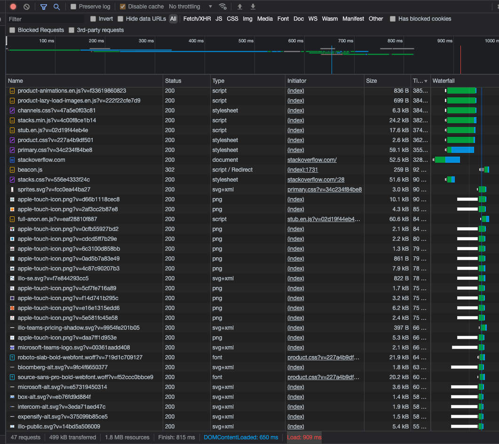
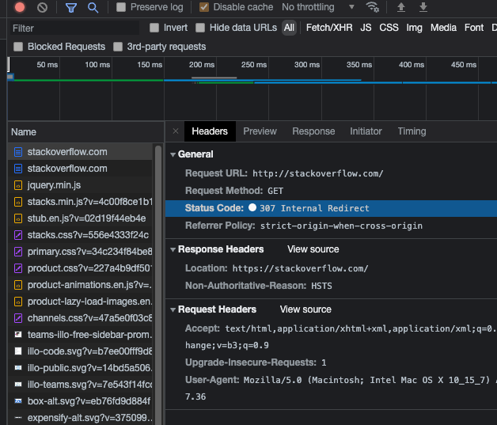
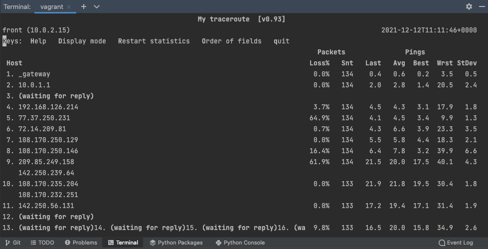

## Домашнее задание к занятию "3.6. Компьютерные сети, лекция 1"

### Задание 1
Работа c HTTP через телнет.
- Подключитесь утилитой телнет к сайту `stackoverflow.com telnet stackoverflow.com 80`
- отправьте HTTP запрос
```
GET /questions HTTP/1.0
HOST: stackoverflow.com
[press enter]
[press enter]
```
- В ответе укажите полученный HTTP код, что он означает?
```
HTTP/1.1 301 Moved Permanently
```
> Код состояния HTTP 301 или Moved Permanently (с англ. — «Перемещено навсегда») — стандартный код ответа HTTP, получаемый в ответ от сервера в ситуации, когда запрошенный ресурс был на постоянной основе перемещён в новое месторасположение, и указывающий на то, что текущие ссылки, использующие данный URL, должны быть обновлены. Адрес нового месторасположения ресурса указывается в поле Location получаемого в ответ заголовка пакета протокола 

### Задание 2
Повторите задание 1 в браузере, используя консоль разработчика F12.
- откройте вкладку Network
- отправьте запрос http://stackoverflow.com
- найдите первый ответ HTTP сервера, откройте вкладку Headers
- укажите в ответе полученный HTTP код.
- проверьте время загрузки страницы, какой запрос обрабатывался дольше всего?
- приложите скриншот консоли браузера в ответ.


> 307 Temporary Redirect — запрашиваемый ресурс на короткое время доступен по другому URI, указанный в поле Location заголовка.
Время загрузки страницы: 909ms
Дольше всего обрабатывается запрос product-animations.en.js?v=f33619860823 первый на картинке(385ms):



### Задание 3
Какой IP адрес у вас в интернете?  
**Ответ:**  
2ip.ru: `46.242.8.95`
### Задание 4
Какому провайдеру принадлежит ваш IP адрес? Какой автономной системе AS? Воспользуйтесь утилитой whois

```
vagrant@nginx:~$ whois 46.242.8.95
% This is the RIPE Database query service.
% The objects are in RPSL format.
%
% The RIPE Database is subject to Terms and Conditions.
% See http://www.ripe.net/db/support/db-terms-conditions.pdf

% Note: this output has been filtered.
%       To receive output for a database update, use the "-B" flag.

% Information related to '46.242.0.0 - 46.242.63.255'

% Abuse contact for '46.242.0.0 - 46.242.63.255' is 'abuse@rt.ru'

inetnum:        46.242.0.0 - 46.242.63.255
netname:        NCN-BBCUST
descr:          NCNET Broadband customers
country:        RU
admin-c:        NCN7-RIPE
tech-c:         NCN7-RIPE
status:         ASSIGNED PA
mnt-by:         NCNET-MNT
created:        2011-02-22T10:54:11Z
last-modified:  2011-02-22T10:54:11Z
source:         RIPE

role:           NCNET NCC Operations
address:        National Cable Networks
address:        Nagatinskaya str., 1, bldn. 26
address:        117105 Moscow, Russia
org:            ORG-NCN1-RIPE
admin-c:        RVP-RIPE
tech-c:         RVP-RIPE
phone:          +7 495 6859542
fax-no:         +7 495 6859530
mnt-by:         NCNET-MNT
nic-hdl:        NCN7-RIPE
created:        2007-03-26T07:46:58Z
last-modified:  2015-10-12T11:53:05Z
source:         RIPE # Filtered
abuse-mailbox:  abuse@moscow.rt.ru

% Information related to '46.242.8.0/23AS42610'

route:          46.242.8.0/23
origin:         AS42610
mnt-by:         NCNET-MNT
created:        2019-10-19T16:58:28Z
last-modified:  2019-10-19T16:58:28Z
source:         RIPE

% This query was served by the RIPE Database Query Service version 1.101 (ANGUS)


vagrant@nginx:~$
```
**Ответ:**  
Провайдер: National Cable Networks  
Автономная система: AS42610  

### Задание 5
Через какие сети проходит пакет, отправленный с вашего компьютера на адрес 8.8.8.8? Через какие AS? Воспользуйтесь утилитой `traceroute`
**Ответ:**
```
sudo apt install traceroute  
vagrant@front:~$ traceroute -An 8.8.8.8  
traceroute to 8.8.8.8 (8.8.8.8), 30 hops max, 60 byte packets  
 1  10.0.2.2 [*]  0.787 ms  0.697 ms  0.666 ms  
 2  10.0.2.2 [*]  7.020 ms  6.989 ms  6.946 ms  
```

### Задание 6
Повторите задание в утилите mtr. На каком участке наибольшая задержка - delay?   
**Ответ:**
```
sudo apt install mtr  
sudo mtr 8.8.8.8  
```

Самая большая задержка на 10 шаге до ip: 108.170.235.204. Так же стоит отметить 9 шаг, где задержки не сильно меньше, но очень большой показатель потерть Loss%

### Задание 7
Какие DNS сервера отвечают за доменное имя dns.google? Какие A записи? воспользуйтесь утилитой `dig`  
**Ответ:**
```
vagrant@front:~$ dig dns.google A +noall +answer
dns.google.             806     IN      A       8.8.4.4 
dns.google.             806     IN      A       8.8.8.8       
vagrant@front:~$ dig dns.google NS +noall +answer    
dns.google.             2533    IN      NS      ns1.zdns.google.  
dns.google.             2533    IN      NS      ns3.zdns.google.  
dns.google.             2533    IN      NS      ns2.zdns.google.  
dns.google.             2533    IN      NS      ns4.zdns.google.  
vagrant@front:~$ 
```
### Задание 8
Проверьте PTR записи для IP адресов из задания 7. Какое доменное имя привязано к IP? воспользуйтесь утилитой `dig`  
**Ответ:**
```
vagrant@front:~$ dig -x 8.8.4.4 +short
dns.google.
vagrant@front:~$ dig -x 8.8.8.8 +short
dns.google.
vagrant@front:~$ 
```